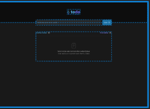
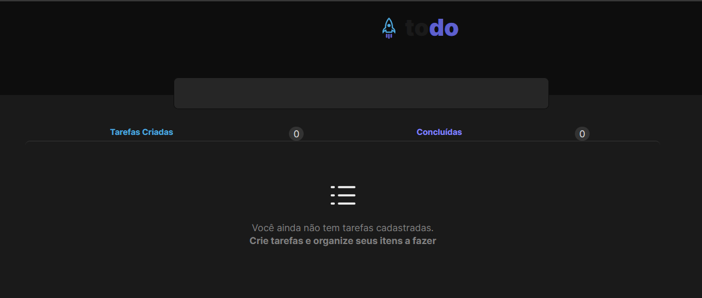

# React + TypeScript + Vite

This template provides a minimal setup to get React working in Vite with HMR and some ESLint rules.

Currently, two official plugins are available:

- [@vitejs/plugin-react](https://github.com/vitejs/vite-plugin-react/blob/main/packages/plugin-react/README.md) uses [Babel](https://babeljs.io/) for Fast Refresh
- [@vitejs/plugin-react-swc](https://github.com/vitejs/vite-plugin-react-swc) uses [SWC](https://swc.rs/) for Fast Refresh

## Desenvolvimento Desafio - Pratica Conhecimento

O projeto passara pelo processo de desenvolvimento de uma lista de afazares interativa. Com opção de adicionar e excluir tarefas, e contador de tarefas concluídas.

### Desenvolvimento aplicação

*React/Typescritp
*phospor icon

#### Parte 1: desenvolvida

*Proposto no design figma pela rockeatSeat

*Desenvolvido até o momento

